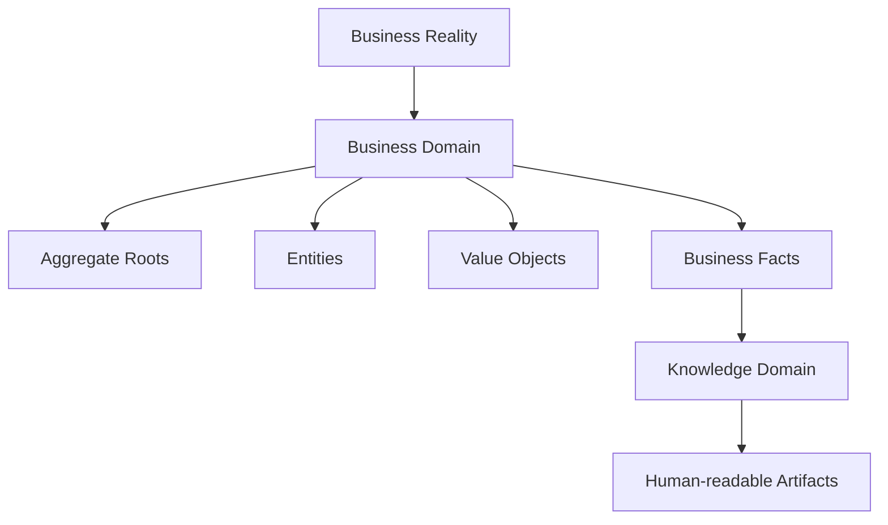

# 03 - Domain Model

**Project:** Intelligent Meeting Minutes Engine

**Version:** 1.0

**Status:** Draft

---

## Depends On

- 00-project-design-handbook.md
- 01-domain-discovery.md
- 02-domain-ontology.md

## Followed By

- 04-business-facts.md
- 05-knowledge-model.md
- 06-processing-pipeline.md
- 07-persistence-model.md
- 08-api-design.md

---

# 1. Purpose

This document defines the complete Business Domain Model of the project.

Its purpose is to specialize the ontology into a concrete and consistent model of:

- Aggregate Roots;
- Entities;
- Value Objects;
- Business Facts;
- semantic relationships;
- business invariants.

This document is normative for all subsequent design and implementation artifacts.

---

# 2. Scope

This Domain Model covers objective business reality related to formal meetings.

It defines:

- business concepts and category assignment;
- identity and lifecycle boundaries;
- relationship multiplicities;
- domain invariants;
- traceability to architecture and ontology rules.

It does not define:

- processing pipelines;
- persistence implementation;
- API contracts;
- prompt design;
- AI interpretation logic.

---

# 3. Dependencies

This document depends on lower-sequence normative sources only.

- 00-project-design-handbook.md defines governance and architectural principles.
- 01-domain-discovery.md provides candidate concepts and open questions.
- 02-domain-ontology.md defines ontological categories and invariants.

Conformance rules:

- If this document conflicts with 00-project-design-handbook.md, the handbook prevails.
- If this document conflicts with 02-domain-ontology.md, the ontology prevails.

---

# 4. Definitions

## 4.1 Concept Ownership

Business concept definitions remain authoritative in 02-domain-ontology.md.

This document does not redefine ontology concepts.

It instantiates them into a complete model with explicit boundaries and constraints.

## 4.2 Normative Language

The keywords SHALL, SHALL NOT, SHOULD, SHOULD NOT and MAY are interpreted according to RFC 2119.

---

# 5. Requirements and Traceability

The following requirements govern this model.

## 5.1 Architecture Traceability

- DM-REQ-001 implements ARCH-008 by excluding Processing Domain concepts from the Business Domain.
- DM-REQ-002 implements ARCH-009 by modeling objective meeting reality instead of secretary workflow.
- DM-REQ-003 implements ARCH-006 by preventing human-readable artifacts from becoming domain inputs.
- DM-REQ-004 aligns with ARCH-007 through one-way derivation from Business Domain to Knowledge Domain.

## 5.2 Ontology Traceability

- DM-REQ-005 implements CAT-001 by assigning every concept to exactly one ontological category.
- DM-REQ-006 implements CAT-003 by restricting identity to Aggregate Roots and Entities.
- DM-REQ-007 implements ONT-004 and INV-003 by treating Business Facts as immutable.
- DM-REQ-008 implements INV-009 through unidirectional dependency toward the Knowledge Domain.
- DM-REQ-009 implements INV-010 by treating Business Facts as objective source of truth.

---

# 6. Design Overview

The model separates persistent business concepts from objective occurrences.

Persistent concepts evolve over time while preserving identity.

Objective occurrences are represented by immutable Business Facts.

---

# 7. Domain Boundaries

## 7.1 Included in Business Domain

- Organization
- Meeting
- Person
- Participant
- Agenda
- Agenda Item
- Discussion
- Intervention
- Motion
- Vote
- Resolution
- Action
- Attachment
- Business Facts catalog

## 7.2 Explicitly Excluded

- Worker, Job, Queue, Retry, Checkpoint
- Segment and speaker diarization structures
- Prompt schemas and model confidence internals
- Minutes document formatting concerns

These excluded elements belong to Processing Domain or Knowledge Domain.

---

# 8. Aggregate Roots

## 8.1 Organization

Category: Aggregate Root

Identity: persistent organizational identity.

Description: institution capable of conducting meetings.

Containment:

- contains zero or more Meetings.

## 8.2 Meeting

Category: Aggregate Root

Identity: persistent meeting identity.

Description: one complete meeting executed by one Organization.

Containment:

- contains Participants;
- contains Discussions;
- contains Business Facts;
- may contain one Agenda;
- may contain Attachments.

Lifecycle: from meeting creation to meeting closure, then historical preservation.

---

# 9. Entities

## 9.1 Person

Category: Entity

Identity: persistent personal identity in organizational context.

Belongs to: one Organization context.

Relations:

- may originate zero to many Participants over time.

## 9.2 Participant

Category: Entity

Identity: one historical participation identity.

Belongs to: exactly one Meeting.

References: exactly one Person.

Role semantics: role is participation-scoped and does not belong directly to Person.

## 9.3 Agenda

Category: Entity

Identity: agenda identity within one Meeting.

Belongs to: exactly one Meeting.

Contains: one or more Agenda Items.

## 9.4 Agenda Item

Category: Entity

Identity: agenda item identity within one Agenda.

Belongs to: exactly one Agenda.

Contains: zero or more Discussions.

## 9.5 Discussion

Category: Entity

Identity: discussion identity within one Meeting.

Belongs to: exactly one Meeting.

Association: concerns exactly one Agenda Item in version 1.

Contains: zero or more Interventions.

May contain: zero or more Motions.

## 9.6 Intervention

Category: Entity

Identity: intervention identity within one Discussion.

Belongs to: exactly one Discussion.

Produced by: exactly one Participant.

## 9.7 Motion

Category: Entity

Identity: motion identity within one Discussion.

Belongs to: exactly one Discussion.

May generate: zero or one Vote.

May be addressed by: zero or many Resolutions.

## 9.8 Vote

Category: Entity

Identity: vote identity linked to one Motion.

Belongs to: exactly one Motion.

May produce: zero or many Resolutions.

## 9.9 Resolution

Category: Entity

Identity: resolution identity within one Meeting.

Belongs to: exactly one Meeting.

Addresses: exactly one Motion.

May create: zero or many Actions.

## 9.10 Action

Category: Entity

Identity: action identity within one Meeting.

Belongs to: exactly one Meeting.

Originates from: exactly one Resolution.

## 9.11 Attachment

Category: Entity

Identity: attachment identity within one Meeting context.

Belongs to: exactly one Meeting.

May be referenced by: Business Facts and related meeting concepts.

---

# 10. Value Objects

The following Value Objects are recognized in this model.

## 10.1 Person Name

No independent identity.

Describes Person.

Immutable and compared by value.

## 10.2 Email Address

No independent identity.

Describes Person or Participant contact metadata when available.

Immutable and compared by value.

## 10.3 Postal Address

No independent identity.

Describes Organization context.

Immutable and compared by value.

## 10.4 Time Interval

No independent identity.

Describes bounded temporal segments of discussions, interventions or votes.

Immutable and compared by value.

## 10.5 Duration

No independent identity.

Describes elapsed time derived from objective timestamps.

Immutable and compared by value.

## 10.6 Date Range

No independent identity.

Describes bounded date periods associated with meeting planning or deadlines.

Immutable and compared by value.

## 10.7 Vote Count

No independent identity.

Describes vote totals associated with Vote outcomes.

Immutable and compared by value.

## 10.8 Participant Role

No independent identity.

Describes responsibilities assumed in one Participant context.

Immutable and compared by value.

---

# 11. Business Facts Catalog (Domain-Level)

Business Facts are immutable objective occurrences.

Each Business Fact belongs to exactly one Meeting and references one or more business concepts.

## 11.1 Meeting Lifecycle Facts

- Meeting Created
- Meeting Started
- Meeting Closed

## 11.2 Participation Facts

- Participant Joined
- Participant Left

## 11.3 Agenda and Discussion Facts

- Agenda Loaded
- Discussion Started
- Discussion Closed

## 11.4 Motion and Vote Facts

- Motion Proposed
- Motion Amended
- Motion Withdrawn
- Vote Started
- Vote Closed

## 11.5 Resolution and Action Facts

- Resolution Approved
- Resolution Rejected
- Action Assigned
- Action Completed

## 11.6 Reference Facts

- Document Referenced

Note: full fact semantics, preconditions and consequences are specified in 04-business-facts.md.

---

# 12. Relationships and Multiplicity

## 12.1 Containment Relationships

- Organization contains Meetings: 1 to many.
- Meeting contains Participants: 0 to many.
- Meeting contains Discussions: 0 to many.
- Meeting contains Business Facts: 0 to many.
- Meeting contains Agenda: 0 to 1.
- Agenda contains Agenda Items: 1 to many.
- Agenda Item contains Discussions: 0 to many.
- Discussion contains Interventions: 0 to many.
- Discussion contains Motions: 0 to many.

## 12.2 Reference Relationships

- Participant references Person: many to 1.
- Resolution addresses Motion: many to 1.
- Action originates from Resolution: many to 1.
- Business Facts reference Business Concepts: many to many.

## 12.3 Association Relationships

- Discussion concerns Agenda Item: many to 1.
- Motion is discussed during Discussion: many to 1.
- Participant contributes to Discussion through Intervention: many to many via Intervention.

---

# 13. Domain Invariants

## 13.1 Identity Invariants

- DMI-001 Only Aggregate Roots and Entities possess identity.
- DMI-002 Identity remains stable for the full business lifecycle.

## 13.2 Historical Invariants

- DMI-003 Business Facts are immutable.
- DMI-004 Historical records are never rewritten.
- DMI-005 Historical Participants remain valid after Meeting closure.

## 13.3 Integrity Invariants

- DMI-006 Every Participant references exactly one Person.
- DMI-007 Every Participant belongs to exactly one Meeting.
- DMI-008 Every Discussion belongs to exactly one Meeting.
- DMI-009 Every Motion belongs to exactly one Discussion.
- DMI-010 Every Vote belongs to exactly one Motion.
- DMI-011 Every Action originates from exactly one Resolution.
- DMI-012 Every Business Fact belongs to exactly one Meeting.

## 13.4 Boundary Invariants

- DMI-013 Processing concepts SHALL NOT appear in the Business Domain.
- DMI-014 Knowledge interpretations SHALL NOT redefine business concepts.
- DMI-015 Human-readable artifacts SHALL NOT be treated as business reality.

---

# 14. Data Models (Conceptual)

This section provides conceptual structures without implementation detail.

## 14.1 Aggregate Roots and Entities Summary

| Concept      | Category       | Identity | Parent Context |
| ------------ | -------------- | -------- | -------------- |
| Organization | Aggregate Root | Yes      | None           |
| Meeting      | Aggregate Root | Yes      | Organization   |
| Person       | Entity         | Yes      | Organization   |
| Participant  | Entity         | Yes      | Meeting        |
| Agenda       | Entity         | Yes      | Meeting        |
| Agenda Item  | Entity         | Yes      | Agenda         |
| Discussion   | Entity         | Yes      | Meeting        |
| Intervention | Entity         | Yes      | Discussion     |
| Motion       | Entity         | Yes      | Discussion     |
| Vote         | Entity         | Yes      | Motion         |
| Resolution   | Entity         | Yes      | Meeting        |
| Action       | Entity         | Yes      | Meeting        |
| Attachment   | Entity         | Yes      | Meeting        |

## 14.2 Value Objects Summary

| Value Object     | Identity | Immutable | Typical Owner      |
| ---------------- | -------- | --------- | ------------------ |
| Person Name      | No       | Yes       | Person             |
| Email Address    | No       | Yes       | Person/Participant |
| Postal Address   | No       | Yes       | Organization       |
| Time Interval    | No       | Yes       | Discussion/Vote    |
| Duration         | No       | Yes       | Discussion/Meeting |
| Date Range       | No       | Yes       | Meeting            |
| Vote Count       | No       | Yes       | Vote               |
| Participant Role | No       | Yes       | Participant        |

---

# 15. Interfaces (Conceptual)

This section defines conceptual interfaces between domains, not software APIs.

## 15.1 IF-DM-001 Business Facts Emission

Output contract from Business Domain:

- immutable Business Facts;
- identity references to related business concepts;
- objective temporal ordering.

Consumer: Knowledge Domain.

## 15.2 IF-DM-002 Business Concepts Reference

Output contract from Business Domain:

- current and historical identities of Aggregate Roots and Entities;
- relationship semantics;
- value-object snapshots relevant to factual interpretation.

Consumer: Knowledge Domain and downstream document generation flows.

---

# 16. Error Handling (Domain Integrity)

Domain errors represent model integrity violations.

## 16.1 Recoverable Violations

- Missing optional relationship at intermediate capture stage.
- Delayed registration of non-critical descriptive Value Objects.

Action: mark as pending and continue observation without rewriting existing facts.

## 16.2 Fatal Violations

- Business Fact without Meeting reference.
- Participant without Person reference.
- Action without Resolution origin.

Action: stop domain state progression for the affected context and require correction.

## 16.3 Prohibited Corrections

- Rewriting historical Business Facts.
- Deleting business history to hide inconsistencies.

Action: append new corrective Business Facts instead.

---

# 17. Implementation Guidance

Implementation artifacts SHALL preserve the model exactly as specified here.

Minimum conformance expectations:

- persistence model maps one-to-one with concept identities;
- API model does not redefine domain concepts;
- processing model does not leak workers, jobs or retries into business concepts;
- knowledge model remains derived and traceable to Business Facts.

---

# 18. Open Questions

The following questions remain open from discovery and require explicit decision records if changed.

- Should one Resolution address multiple Motions in future versions?
- Should Discussions outside a formal Agenda be represented in version 2?
- Should postponed Agenda Items require an explicit Business Fact subtype?

Current version decisions in this document prioritize consistency and minimal conceptual set.

---

# 19. Future Improvements

- Expand attachment semantics with explicit reference roles.
- Refine intervention granularity when additional business evidence is available.
- Extend organization-specific specializations without changing core concepts.
- Add formal conformance checklist per subsequent document.

---

# 20. Changelog

## 1.0.0

- First complete version of Domain Model document.
- Aligned with ontology categories, invariants and dependency rules.
- Added explicit concept catalog, multiplicities and domain invariants.
- Added conceptual interfaces and domain integrity error handling.
