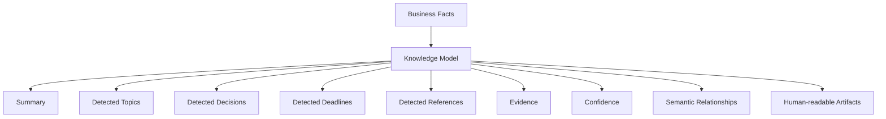

# 05 - Knowledge Model

**Project:** Intelligent Meeting Minutes Engine

**Version:** 1.0

**Status:** Draft

---

## Depends On

- 00-project-design-handbook.md
- 01-domain-discovery.md
- 02-domain-ontology.md
- 03-domain-model.md
- 04-business-facts.md

## Followed By

- 06-processing-pipeline.md
- 07-persistence-model.md
- 08-api-design.md

---

# 1. Purpose

This document defines the Knowledge Model of the project.

Its purpose is to describe the interpretive layer that derives from Business Facts.

The Knowledge Model SHALL NOT redefine business reality.

It SHALL interpret, summarize, and structure objective occurrences into human-usable knowledge.

---

# 2. Scope

This document covers the conceptual representation of knowledge derived from the Business Domain.

It defines:

- the boundary between Business Domain and Knowledge Domain;
- the main knowledge concepts produced from Business Facts;
- the relationship between evidence and interpretation;
- the rules for traceability and confidence;
- the conceptual outputs that may feed human-readable artifacts.

It does not define:

- persistence implementation;
- processing worker behavior;
- prompts or model internals;
- document layout or presentation details.

---

# 3. Dependencies

This document depends on the normative sources listed below.

- 00-project-design-handbook.md defines governance and architecture constraints.
- 02-domain-ontology.md defines the separation between Business Domain and Knowledge Domain.
- 03-domain-model.md defines the underlying business concepts.
- 04-business-facts.md defines the immutable facts that feed interpretation.

Conformance rules:

- If this document conflicts with 00-project-design-handbook.md, the handbook prevails.
- If this document conflicts with 02-domain-ontology.md, the ontology prevails.

---

# 4. Design Principles

## KM-001 — Derived Interpretation

Knowledge SHALL be derived from Business Facts.

No interpretation SHALL exist without supporting facts.

## KM-002 — No Redefinition

The Knowledge Model SHALL NOT redefine Business Domain concepts.

It SHALL only interpret them.

## KM-003 — Traceability

Every knowledge element SHALL be traceable to one or more Business Facts.

## KM-004 — Evidence First

Interpretations without evidence SHALL NOT be considered authoritative.

## KM-005 — Confidence Is Not Truth

Confidence scores SHALL indicate support strength, not business reality.

## KM-006 — Human-Readable Output

Knowledge may be used to generate minutes, summaries, reports and similar artifacts.

Those artifacts SHALL remain downstream of the Knowledge Model.

---

# 5. Domain Boundary

## 5.1 Business Domain

The Business Domain contains objective business concepts and immutable Business Facts.

It describes what happened.

## 5.2 Knowledge Domain

The Knowledge Domain contains interpretations of what happened.

It describes what the system understands.

## 5.3 Dependency Rule

The dependency is strictly one-way:

Business Domain -> Knowledge Domain -> Human-readable artifacts.

Interpretations SHALL NOT modify business reality.

---

# 6. Conceptual Overview

The Knowledge Model is structured around the following interpretive concepts.

---

# 7. Core Knowledge Concepts

This section defines the principal knowledge artifacts that can be derived from the Business Facts.

These concepts describe interpretation, not business reality.

## 7.1 Summary

Represents a condensed interpretation of the meeting.

Purpose:

- convey the overall meaning of the meeting;
- support generation of minutes and summaries;
- provide a compact narrative overview for downstream artifacts.

Traceability:

- derived from one or more Business Facts;
- linked to relevant concepts such as Meeting, Discussion, Resolution and Action.

## 7.2 Detected Topic

Represents a topic inferred from the meeting content.

Purpose:

- identify recurring themes or subject matter;
- support retrieval and organization.

Traceability:

- derived from discussion and motion facts;
- linked to evidence and supporting facts.

## 7.3 Detected Decision

Represents a decision inferred from the meeting.

Purpose:

- identify outcomes such as approvals, rejections, or accepted proposals.

Traceability:

- derived from Resolution and Vote Business Facts;
- never treated as a business fact itself.

## 7.4 Detected Deadline

Represents a deadline inferred from meeting content.

Purpose:

- surface obligations associated with Actions or Resolutions.

Traceability:

- derived from Action-related facts and supporting evidence;
- must remain linked to the underlying business concepts.

## 7.5 Detected Reference

Represents a reference that appears to be relevant to the meeting.

Purpose:

- identify documents, attachments, or external material referenced during the meeting.

Traceability:

- derived from Document Referenced and related facts.

## 7.6 Evidence

Represents the supporting justification for a knowledge element.

Purpose:

- explain why a conclusion exists;
- preserve traceability.

Traceability:

- each Evidence item SHALL reference one or more Business Facts.

## 7.7 Confidence Score

Represents the estimated confidence assigned to an interpretation.

Purpose:

- quantify support strength;
- support review and downstream filtering.

Traceability:

- derived from the evidence available for the interpretation.

## 7.8 Semantic Relationship

Represents a meaningful relation inferred between concepts.

Purpose:

- express inferred links such as topic-to-decision or action-to-deadline.

Traceability:

- derived from facts and supporting evidence;
- never replaces explicit relationships in the Business Domain.

---

# 8. Knowledge Model Structure

The Knowledge Model SHALL be organized around the following conceptual components.

## 8.1 Meeting Knowledge

Represents the complete interpretive view of one Meeting.

Contains:

- Summary;
- Detected Topics;
- Detected Decisions;
- Detected Deadlines;
- Detected References;
- Evidence chains;
- Confidence assessments.

## 8.2 Knowledge Element

Represents one interpretation unit derived from one or more Business Facts.

Every Knowledge Element SHALL contain:

- a semantic label;
- a set of evidence references;
- a confidence value;
- a link to the relevant business concepts.

## 8.3 Evidence Chain

Represents the chain of facts supporting a knowledge conclusion.

Purpose:

- preserve explainability;
- allow review and debugging.

---

# 9. Relationship to Business Facts

The Knowledge Model SHALL consume Business Facts as its primary input.

The relation between both layers SHALL be:

- Facts provide objective evidence.
- Knowledge provides interpretation.

The following rule is normative:

A knowledge conclusion is valid only if it can be traced to one or more Business Facts.

---

# 10. Representation Rules

## 10.1 Interpretation Rules

Knowledge SHALL be expressed as structured data.

The model SHALL avoid free-text conclusions when a structured representation is available.

## 10.2 Validation Rules

Every knowledge element SHALL be validated against:

- the supporting Business Facts;
- the relevant business concepts;
- the confidence policy.

## 10.3 Rejection Rule

An interpretation SHALL be rejected when:

- no evidence exists;
- the evidence contradicts the interpretation;
- the interpretation cannot be mapped to known business concepts.

---

# 11. Knowledge Invariants

## KM-INV-001

Knowledge SHALL derive from Business Facts.

## KM-INV-002

Knowledge SHALL NOT redefine Business Domain concepts.

## KM-INV-003

Every knowledge element SHALL be traceable to evidence.

## KM-INV-004

Confidence values SHALL remain informational and SHALL NOT substitute for factual certainty.

## KM-INV-005

Knowledge may evolve as evidence improves, but Business Facts remain immutable.

---

# 12. Conceptual Data Model

This section defines the conceptual structure of the Knowledge Model without implementation detail.

## 12.1 Core Entities

| Concept               | Purpose                                   | Primary Input               |
| --------------------- | ----------------------------------------- | --------------------------- |
| Summary               | Condensed understanding of the meeting    | Business Facts              |
| Detected Topic        | Inferred topic from meeting content       | Discussion and Motion facts |
| Detected Decision     | Inferred decision outcome                 | Resolution and Vote facts   |
| Detected Deadline     | Inferred deadline or obligation           | Action-related facts        |
| Detected Reference    | Inferred relevant reference               | Document Referenced facts   |
| Evidence              | Supporting justification for a conclusion | Business Facts              |
| Confidence Score      | Support level for an interpretation       | Evidence                    |
| Semantic Relationship | Inferred link between knowledge concepts  | Evidence and facts          |

## 12.2 Relationship Rules

- A Summary is supported by multiple Evidence items.
- A Detected Decision is supported by one or more Resolution or Vote facts.
- A Detected Deadline is supported by one or more Action facts.
- A Detected Reference is supported by a Document Referenced fact.
- Semantic Relationships are derived from evidence and business context.

---

# 13. Interfaces (Conceptual)

## 13.1 IF-KM-001 — Input from Business Facts

Input contract:

- immutable Business Facts;
- references to business concepts;
- temporal ordering.

## 13.2 IF-KM-002 — Output to Human-readable Artifacts

Output contract:

- Summary;
- Detected Topics;
- Detected Decisions;
- Detected Deadlines;
- Detected References;
- Evidence chains;
- Confidence assessments.

These outputs are interpretations and are not Business Domain facts.

---

# 14. Error Handling (Knowledge Integrity)

## 14.1 Recoverable Errors

- Evidence is incomplete but a provisional interpretation exists.
- Confidence is low because the supporting facts are sparse.

Action: keep the interpretation as provisional and mark it as low-confidence.

## 14.2 Fatal Errors

- A knowledge element has no supporting evidence.
- A knowledge element references a concept that does not exist in the Business Domain.
- A knowledge element contradicts a known immutable fact without explicit evidence.

Action: reject or quarantine the interpretation.

---

# 15. Open Questions

The following questions remain open for future refinement.

- Should confidence be represented as a scalar, a band or a structured assessment?
- Should the model distinguish between “detected decision” and “approved outcome” in version 2?
- Should deadline extraction be limited to explicit dates or also include implicit obligations?

---

# 16. Future Improvements

- Add a formal knowledge lifecycle for creation, revision and retirement.
- Expand the knowledge concepts with richer semantic relations.
- Define explicit schemas for downstream minutes and report generation.
- Add a conformance checklist for knowledge outputs.

---

# 17. Changelog

## 1.0.0

- Created initial structure for the Knowledge Model document.
- Aligned the proposed model with the Business Domain, Business Facts and ontology constraints.
- Established the interpretive boundary and evidence-based traceability rules.

## 7.2 Detected Topic

Represents a topic inferred from the meeting content.

Purpose:

- identify recurring themes or subject matter;
- support retrieval and organization.

Traceability:

- derived from discussion and motion facts;
- linked to evidence and supporting facts.

## 7.3 Detected Decision

Represents a decision inferred from the meeting.

Purpose:

- identify outcomes such as approvals, rejections, or accepted proposals.

Traceability:

- derived from Resolution and Vote Business Facts;
- never treated as a business fact itself.

## 7.4 Detected Deadline

Represents a deadline inferred from meeting content.

Purpose:

- surface obligations associated with Actions or Resolutions.

Traceability:

- derived from Action-related facts and supporting evidence;
- must remain linked to the underlying business concepts.

## 7.5 Detected Reference

Represents a reference that appears to be relevant to the meeting.

Purpose:

- identify documents, attachments, or external material referenced during the meeting.

Traceability:

- derived from Document Referenced and related facts.

## 7.6 Evidence

Represents the supporting justification for a knowledge element.

Purpose:

- explain why a conclusion exists;
- preserve traceability.

Traceability:

- each Evidence item SHALL reference one or more Business Facts.

## 7.7 Confidence Score

Represents the estimated confidence assigned to an interpretation.

Purpose:

- quantify support strength;
- support review and downstream filtering.

Traceability:

- derived from the evidence available for the interpretation.

## 7.8 Semantic Relationship

Represents a meaningful relation inferred between concepts.

Purpose:

- express inferred links such as topic-to-decision or action-to-deadline.

Traceability:

- derived from facts and supporting evidence;
- never replaces explicit relationships in the Business Domain.

---

# 8. Knowledge Model Structure

The Knowledge Model SHALL be organized around the following conceptual components.

## 8.1 Meeting Knowledge

Represents the complete interpretive view of one Meeting.

Contains:

- Summary;
- Detected Topics;
- Detected Decisions;
- Detected Deadlines;
- Detected References;
- Evidence chains;
- Confidence assessments.

## 8.2 Knowledge Element

Represents one interpretation unit derived from one or more Business Facts.

Every Knowledge Element SHALL contain:

- a semantic label;
- a set of evidence references;
- a confidence value;
- a link to the relevant business concepts.

## 8.3 Evidence Chain

Represents the chain of facts supporting a knowledge conclusion.

Purpose:

- preserve explainability;
- allow review and debugging.

---

# 9. Relationship to Business Facts

The Knowledge Model SHALL consume Business Facts as its primary input.

The relation between both layers SHALL be:

- Facts provide objective evidence.
- Knowledge provides interpretation.

The following rule is normative:

A knowledge conclusion is valid only if it can be traced to one or more Business Facts.

---

# 10. Representation Rules

## 10.1 Interpretation Rules

Knowledge SHALL be expressed as structured data.

The model SHALL avoid free-text conclusions when a structured representation is available.

## 10.2 Validation Rules

Every knowledge element SHALL be validated against:

- the supporting Business Facts;
- the relevant business concepts;
- the confidence policy.

## 10.3 Rejection Rule

An interpretation SHALL be rejected when:

- no evidence exists;
- the evidence contradicts the interpretation;
- the interpretation cannot be mapped to known business concepts.

---

# 11. Knowledge Invariants

## KM-INV-001

Knowledge SHALL derive from Business Facts.

## KM-INV-002

Knowledge SHALL NOT redefine Business Domain concepts.

## KM-INV-003

Every knowledge element SHALL be traceable to evidence.

## KM-INV-004

Confidence values SHALL remain informational and SHALL NOT substitute for factual certainty.

## KM-INV-005

Knowledge may evolve as evidence improves, but Business Facts remain immutable.

---

# 12. Conceptual Data Model

This section defines the conceptual structure of the Knowledge Model without implementation detail.

## 12.1 Core Entities

| Concept               | Purpose                                   | Primary Input               |
| --------------------- | ----------------------------------------- | --------------------------- |
| Summary               | Condensed understanding of the meeting    | Business Facts              |
| Detected Topic        | Inferred topic from meeting content       | Discussion and Motion facts |
| Detected Decision     | Inferred decision outcome                 | Resolution and Vote facts   |
| Detected Deadline     | Inferred deadline or obligation           | Action-related facts        |
| Detected Reference    | Inferred relevant reference               | Document Referenced facts   |
| Evidence              | Supporting justification for a conclusion | Business Facts              |
| Confidence Score      | Support level for an interpretation       | Evidence                    |
| Semantic Relationship | Inferred link between knowledge concepts  | Evidence and facts          |

## 12.2 Relationship Rules

- A Summary is supported by multiple Evidence items.
- A Detected Decision is supported by one or more Resolution or Vote facts.
- A Detected Deadline is supported by one or more Action facts.
- A Detected Reference is supported by a Document Referenced fact.
- Semantic Relationships are derived from evidence and business context.

---

# 13. Interfaces (Conceptual)

## 13.1 IF-KM-001 — Input from Business Facts

Input contract:

- immutable Business Facts;
- references to business concepts;
- temporal ordering.

## 13.2 IF-KM-002 — Output to Human-readable Artifacts

Output contract:

- Summary;
- Detected Topics;
- Detected Decisions;
- Detected Deadlines;
- Detected References;
- Evidence chains;
- Confidence assessments.

These outputs are interpretations and are not Business Domain facts.

---

# 14. Error Handling (Knowledge Integrity)

## 14.1 Recoverable Errors

- Evidence is incomplete but a provisional interpretation exists.
- Confidence is low because the supporting facts are sparse.

Action: keep the interpretation as provisional and mark it as low-confidence.

## 14.2 Fatal Errors

- A knowledge element has no supporting evidence.
- A knowledge element references a concept that does not exist in the Business Domain.
- A knowledge element contradicts a known immutable fact without explicit evidence.

Action: reject or quarantine the interpretation.

---

# 15. Open Questions

The following questions remain open for future refinement.

- Should confidence be represented as a scalar, a band or a structured assessment?
- Should the model distinguish between “detected decision” and “approved outcome” in version 2?
- Should deadline extraction be limited to explicit dates or also include implicit obligations?

---

# 16. Future Improvements

- Add a formal knowledge lifecycle for creation, revision and retirement.
- Expand the knowledge concepts with richer semantic relations.
- Define explicit schemas for downstream minutes and report generation.
- Add a conformance checklist for knowledge outputs.

---

# 17. Changelog

## 1.0.0

- Created initial structure for the Knowledge Model document.
- Aligned the proposed model with the Business Domain, Business Facts and ontology constraints.
- Established the interpretive boundary and evidence-based traceability rules.
