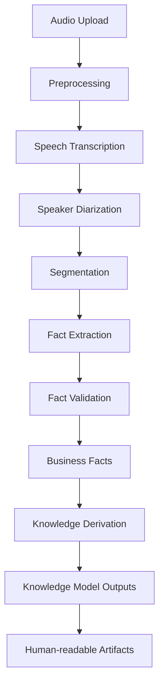

# 06 - Processing Pipeline

**Project:** Intelligent Meeting Minutes Engine

**Version:** 1.0

**Status:** Draft

---

## Depends On

- 00-project-design-handbook.md
- 01-domain-discovery.md
- 02-domain-ontology.md
- 03-domain-model.md
- 04-business-facts.md
- 05-knowledge-model.md

## Followed By

- 07-persistence-model.md
- 08-api-design.md

---

# 1. Purpose

This document defines the conceptual processing pipeline used to transform raw meeting inputs into structured Business Facts and Knowledge Model outputs.

Its purpose is to describe how the system operates, while keeping the Processing Domain separate from the Business Domain.

---

# 2. Scope

This document covers the processing flow for version 1.

It defines:

- the processing stages from input to output;
- the responsibility of each stage;
- how Business Facts are discovered and validated;
- how Knowledge Model outputs are derived;
- the rules for restartability, traceability and error handling.

It does not define:

- implementation code;
- persistence schema;
- UI design;
- prompt implementation details beyond conceptual requirements.

---

# 3. Dependencies

This document depends on the normative sources listed below.

- 00-project-design-handbook.md defines architectural and governance constraints.
- 02-domain-ontology.md defines the separation between Business Domain and Processing Domain.
- 03-domain-model.md defines the business concepts to be observed.
- 04-business-facts.md defines the facts that must be produced.
- 05-knowledge-model.md defines the interpretive outputs that may be derived.

---

# 4. Processing Principles

## PROC-001 — Separation of Concerns

Processing concepts SHALL NOT leak into the Business Domain.

## PROC-002 — Restartability

Every processing stage SHALL be restartable.

## PROC-003 — Traceability

Every intermediate or final output SHALL be traceable to the input evidence and to the corresponding Business Facts where applicable.

## PROC-004 — Structured Output

Processing stages SHALL produce structured data, not free-form interpretations, whenever the expected output is structured.

## PROC-005 — Evidence-Based Interpretation

Interpretations SHALL be derived only from validated Business Facts and supporting evidence.

---

# 5. Processing Domain Boundary

The Processing Domain contains the operational mechanics of the system.

It includes:

- ingestion;
- transcription;
- diarization;
- segmentation;
- extraction;
- validation;
- restart and checkpoint management.

The Business Domain contains:

- Meeting;
- Participant;
- Discussion;
- Motion;
- Resolution;
- Action;
- Business Facts.

The Knowledge Domain contains:

- interpretations and derived summaries.

The flow is:

Input -> Processing Domain -> Business Facts -> Knowledge Model -> Human-readable Artifacts.

---

# 6. Conceptual Pipeline

The conceptual pipeline for version 1 consists of the following stages.

---

# 7. Stage Definitions

## 7.1 Audio Upload

Purpose:

- ingest the meeting recording into the project workspace.

Outputs:

- stored raw audio artifact;
- meeting workspace reference.

Constraints:

- original audio shall never be modified;
- processing must remain offline.

## 7.2 Preprocessing

Purpose:

- normalize the audio for downstream analysis.

Outputs:

- preprocessed audio artifact;
- metadata required for traceability.

Constraints:

- preprocessing SHALL NOT alter the original source artifact.

## 7.3 Speech Transcription

Purpose:

- convert audio into a structured text representation.

Outputs:

- transcript segments;
- timestamps;
- speaker attribution where available.

Constraints:

- transcript output SHALL be structured and traceable.

## 7.4 Speaker Diarization

Purpose:

- associate speech segments with speakers.

Outputs:

- speaker labels;
- speaker timelines;
- association to segments.

Constraints:

- speaker labels are processing artifacts and SHALL NOT redefine Participant identity in the Business Domain.

## 7.5 Segmentation

Purpose:

- divide the transcript into meaningful units for analysis.

Outputs:

- segments;
- segment metadata;
- links to the source transcript.

Constraints:

- segmentation is operational and SHALL NOT create domain concepts by itself.

## 7.6 Fact Extraction

Purpose:

- identify candidate Business Facts and business concepts from the processed evidence.

Outputs:

- candidate facts;
- candidate concept references;
- evidence references.

Constraints:

- extracted candidates SHALL be validated before being accepted as Business Facts.

## 7.7 Fact Validation

Purpose:

- confirm that a candidate fact is objective, traceable and compatible with the Domain Model.

Outputs:

- accepted Business Facts;
- rejected candidates;
- validation notes.

Constraints:

- hallucinated or unsupported claims SHALL be rejected.
- every accepted fact SHALL reference the underlying evidence.

## 7.8 Knowledge Derivation

Purpose:

- interpret validated Business Facts into Knowledge Model concepts.

Outputs:

- Summary;
- Detected Topics;
- Detected Decisions;
- Detected Deadlines;
- Detected References;
- Evidence chains;
- Confidence assessments.

Constraints:

- interpretations SHALL be derived from Business Facts only.
- unsupported interpretations SHALL be rejected or marked provisional.

---

# 8. Data Flow and Traceability

Each stage SHALL preserve a trace chain from input to output.

The minimum traceability requirements are:

- source artifact reference;
- stage identifier;
- timestamp;
- evidence reference;
- resulting Business Fact or knowledge element identifier.

This traceability allows the system to explain why a particular fact or interpretation exists.

---

# 9. Restart and Recovery Model

The pipeline SHALL be restartable at every stage.

## 9.1 Restartability Rules

- any completed stage may be re-executed without destroying prior evidence;
- intermediate outputs SHALL be checkpointed or stored as recoverable artifacts;
- reprocessing SHALL not rewrite immutable Business Facts.

## 9.2 Recovery Expectations

If a stage fails:

- the system SHALL stop only the affected branch if the error is local;
- the system SHALL preserve the last valid state;
- the failure SHALL be logged with correlation metadata.

---

# 10. Validation and Quality Gates

The pipeline SHALL include validation gates before facts or interpretations are accepted.

## 10.1 Validation Gate for Business Facts

A candidate fact SHALL be accepted only if:

- it is supported by evidence;
- it belongs to one Meeting;
- it references known business concepts;
- it does not contradict prior immutable facts.

## 10.2 Validation Gate for Knowledge Outputs

A knowledge output SHALL be accepted only if:

- it is supported by one or more Business Facts;
- it can be traced to evidence;
- it does not redefine Business Domain concepts.

---

# 11. Error Handling

## 11.1 Recoverable Errors

Examples:

- temporary transcription failure;
- temporary diarization failure;
- incomplete evidence.

Action:

- retry the stage;
- preserve the latest checkpoint;
- continue only when the stage can be re-executed safely.

## 11.2 Fatal Errors

Examples:

- invalid meeting context;
- missing required Business Fact context;
- contradiction with immutable historical facts.

Action:

- stop the affected branch;
- notify the operator;
- preserve the evidence for review.

---

# 12. Conceptual Interfaces

## 12.1 IF-PIPE-001 — Input Interface

Input:

- audio artifact;
- meeting workspace;
- processing configuration.

Output:

- preprocessed artifacts and metadata.

## 12.2 IF-PIPE-002 — Fact Output Interface

Input:

- validated evidence and candidate facts.

Output:

- accepted Business Facts.

## 12.3 IF-PIPE-003 — Knowledge Output Interface

Input:

- validated Business Facts.

Output:

- Knowledge Model outputs.

---

# 13. Open Questions

The following questions remain open for future specification.

- Should the system support partial fact extraction when evidence is incomplete?
- Should fact validation occur immediately after extraction or after a second pass?
- Should the pipeline preserve multiple alternative interpretations before selecting one?

---

# 14. Future Improvements

- Add explicit stage checkpoints and replay semantics.
- Introduce formal decision records for validation thresholds.
- Expand traceability to include worker and correlation identifiers.
- Define failure recovery policies per processing stage.

---

# 15. Changelog

## 1.0.0

- Created the initial conceptual processing pipeline document.
- Aligned the processing flow with the Business Domain, Business Facts and Knowledge Model.
- Defined restartability, traceability and validation gates.
