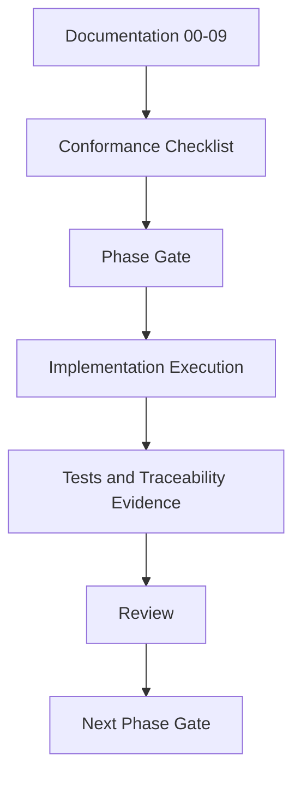

# 10 - Implementation Plan by Phases

**Project:** Intelligent Meeting Minutes Engine

**Version:** 1.1

**Status:** Draft

---

## Depends On

- 00-project-design-handbook.md
- 02-domain-ontology.md
- 03-domain-model.md
- 04-business-facts.md
- 05-knowledge-model.md
- 06-processing-pipeline.md
- 07-persistence-model.md
- 08-api-design.md
- 09-project-structure.md

---

# 1. Purpose

This document converts the implementation structure proposal into an execution plan by phases.

Its purpose is to ensure implementation remains aligned with project documentation and does not drift, omit, or contradict approved planning.

---

# 2. Scope

This plan defines:

- phased implementation sequence;
- deliverables and completion criteria per phase;
- control methodology to avoid divergence;
- governance and review checkpoints;
- recommended conversation threads (chats) and required context per thread.

This plan does not define:

- specific sprint calendars;
- team staffing;
- deployment topology details.

---

# 3. Dependencies

This plan is normative only if aligned with prior documents.

If any contradiction exists:

- 00-project-design-handbook.md prevails;
- then 02-domain-ontology.md;
- then 03 to 09 documents by sequence.

---

# 4. Design

## 4.1 Planning Assumptions

Given the current constraints:

- one person will execute the full implementation;
- delivery is incremental and can be released in slices;
- the target date is the first week of December of the current year;
- the solution must run locally and use only free/open-source software with no commercial licensing requirements;
- the hardware available is a bare-metal Xeon 8-core server with 32 GB RAM and 1 TB SSD, without GPU.

Because of these constraints, the implementation SHALL prioritize a minimal viable end-to-end flow first, then expand capabilities incrementally.

## 4.2 Phase Strategy

Implementation SHALL progress in six phases.

Each phase produces auditable outputs and has explicit entry/exit gates.

No phase may start unless the previous phase exit gate is passed.

The implementation SHALL favor small, testable increments over broad, high-risk scope.

## 4.3 Phase Catalog

### Phase 0 - Governance and Baseline

Objective:

- establish execution controls before coding.

Scope:

- finalize traceability matrix;
- define ADR workflow;
- define Definition of Done template;
- create compliance checklist from docs 00-09;
- establish the initial repository skeleton and Python environment.

Deliverables:

- implementation checklist v1;
- ADR template and registry;
- conformance checklist for PRs;
- initial project skeleton with test tooling.

Exit gate:

- checklist approved;
- contradiction protocol approved;
- traceability workflow approved;
- baseline local environment verified.

### Phase 1 - Domain and Business Facts Core

Objective:

- implement core domain model and immutable business facts.

Scope:

- implement domain entities and value objects from 03;
- implement business fact catalog structures from 04;
- implement domain invariants and fact immutability rules.

Deliverables:

- domain package with tests;
- business facts package with validators;
- invariant test suite.

Exit gate:

- all domain invariants covered by tests;
- business fact immutability enforced;
- no processing concepts leaking into domain modules.

### Phase 2 - Persistence Foundation

Objective:

- persist domain and fact models consistently.

Scope:

- implement repositories and mappings from 07;
- implement UTC/UUIDv7/deleted_at rules;
- implement traceability fields;
- create the first local PostgreSQL-backed persistence slice.

Deliverables:

- persistence adapters;
- migration baseline;
- repository integration tests.

Exit gate:

- successful round-trip tests for domain entities and facts;
- immutable fact write policy verified;
- soft delete policy verified;
- local database can be created and migrated reproducibly.

### Phase 3 - Processing Pipeline MVP

Objective:

- produce validated Business Facts from audio.

Scope:

- implement ingestion, preprocessing, transcription, diarization, segmentation and extraction flow from 06;
- implement validation gates for accepted facts;
- implement restart/checkpoint mechanics;
- prioritize a minimal viable slice: upload audio -> transcription -> candidate fact extraction -> validation.

Deliverables:

- pipeline orchestrator;
- stage-level checkpoints;
- processing logs with correlation metadata.
- first end-to-end local run on a sample meeting.

Exit gate:

- pipeline can be resumed after controlled interruption;
- accepted facts are traceable to evidence;
- invalid/hallucinated candidates are rejected;
- at least one local sample run completes successfully.

### Phase 4 - Knowledge Derivation and Artifact Generation

Objective:

- derive knowledge outputs and generate human-readable artifacts.

Scope:

- implement knowledge model outputs from 05;
- implement evidence chains and confidence support;
- implement minutes/summaries/reports export flow;
- keep artifact generation downstream and non-reentrant to upstream processing.

Deliverables:

- knowledge services and evaluators;
- export service for md/docx/pdf;
- quality checks for traceability.

Exit gate:

- every knowledge element links to one or more business facts;
- artifact generation does not feed upstream processing;
- confidence is informational only;
- generated artifacts can be produced from a validated facts set.

### Phase 5 - API and Operational Hardening

Objective:

- expose stable interfaces and harden operations.

Scope:

- implement API resources from 08;
- implement error semantics and pagination;
- strengthen observability, backup and recovery procedures;
- prepare a minimal operator workflow for local execution and review.

Deliverables:

- API endpoints and contracts;
- end-to-end tests from input to export;
- operations runbook.

Exit gate:

- API contracts validated against domain model;
- end-to-end tests passing;
- recovery procedures validated;
- at least 90% of tests pass.

---

# 5. Diagrams

---

# 6. Data Models

## 6.1 Phase Record (Execution Tracking)

Suggested tracking fields:

- phase_id;
- phase_name;
- objective;
- deliverables;
- entry_criteria;
- exit_criteria;
- status;
- owner;
- started_at;
- finished_at.

## 6.2 Traceability Record

Suggested tracking fields:

- implementation_item;
- source_document;
- source_rule_id;
- test_reference;
- review_status;
- contradiction_flag.

---

# 7. Interfaces

## 7.1 IF-PLAN-001 - Conformance Check Interface

Input:

- implementation change;
- referenced requirements;
- affected modules.

Output:

- pass/fail conformance result;
- missing references;
- contradiction alerts.

## 7.2 IF-PLAN-002 - Phase Gate Review Interface

Input:

- phase deliverables;
- test evidence;
- traceability matrix updates.

Output:

- gate approval;
- gate rejection with corrective actions.

---

# 8. Methodology to Prevent Drift, Omissions and Contradictions

## 8.1 Normative Implementation Loop

Each feature SHALL follow this sequence:

1. Requirement mapping: link feature to docs and rule IDs.
2. Design check: verify no conflict with ontology/domain boundaries.
3. Implementation: code only within mapped scope.
4. Validation: run unit/integration tests and traceability checks.
5. Review gate: approve or reject with explicit reasons.
6. Documentation update: update affected docs and changelog if needed.

## 8.2 Contradiction Protocol

If contradiction is detected:

1. Stop implementation on affected scope.
2. Register contradiction with source references.
3. Propose minimal correction in the lowest valid document sequence.
4. Approve correction before resuming implementation.

## 8.3 Omission Control

Before closing any task, verify:

- associated invariants are tested;
- required logs/traceability metadata exist;
- failure handling has tests or explicit pending decision;
- documentation references are complete.

## 8.4 Change Governance

Any non-trivial architectural change SHALL include:

- ADR entry;
- impact analysis;
- affected document list;
- migration or compatibility notes.

---

# 9. Recommended Chat Threads and Required Context

## 9.1 Thread A - Governance and Traceability

Goal:

- manage phase gates, ADRs, contradiction handling and checklist quality.

Mandatory context:

- 00-project-design-handbook.md;
- 02-domain-ontology.md;
- 03-domain-model.md;
- current traceability matrix;
- this implementation plan.

Primary outputs:

- approved gates;
- contradiction records;
- updated compliance checklists.

## 9.2 Thread B - Domain and Facts Implementation

Goal:

- implement and test modules from phase 1.

Mandatory context:

- 03-domain-model.md;
- 04-business-facts.md;
- phase 1 gate criteria.

Primary outputs:

- domain classes;
- fact validators;
- invariant tests.

## 9.3 Thread C - Persistence Implementation

Goal:

- implement persistence from phase 2.

Mandatory context:

- 07-persistence-model.md;
- phase 2 gate criteria;
- constraints from handbook section 9.

Primary outputs:

- repository adapters;
- migrations;
- integration tests.

## 9.4 Thread D - Processing Pipeline Implementation

Goal:

- implement phase 3 operational flow.

Mandatory context:

- 06-processing-pipeline.md;
- 04-business-facts.md;
- restartability and logging rules.

Primary outputs:

- stage modules;
- checkpoint handling;
- fact extraction/validation flow.

## 9.5 Thread E - Knowledge and Exports

Goal:

- implement phase 4 derivation and artifact generation.

Mandatory context:

- 05-knowledge-model.md;
- 04-business-facts.md;
- rules preventing upstream feedback from generated documents.

Primary outputs:

- knowledge derivation services;
- evidence chain generation;
- export pipelines.

## 9.6 Thread F - API and Hardening

Goal:

- implement and stabilize phase 5 interfaces and operations.

Mandatory context:

- 08-api-design.md;
- 07-persistence-model.md;
- end-to-end validation criteria.

Primary outputs:

- endpoint modules;
- contract tests;
- runbook and recovery checks.

## 9.7 Thread G - Integration and Release Readiness

Goal:

- cross-phase integration, quality gates, release candidate reviews.

Mandatory context:

- outputs from threads A-F;
- full test reports;
- unresolved contradictions list.

Primary outputs:

- release readiness report;
- final conformance review;
- go/no-go decision.

---

# 10. Error Handling

## 10.1 Plan-Level Recoverable Issues

Examples:

- delayed deliverable;
- incomplete evidence for a gate;
- minor test instability.

Action:

- keep phase open;
- define corrective tasks;
- re-run gate.

## 10.2 Plan-Level Fatal Issues

Examples:

- contradiction with handbook or ontology;
- untraceable implementation decisions;
- invariant failures in core domain.

Action:

- stop affected phase;
- trigger contradiction protocol;
- resume only after correction approval.

---

# 11. Open Questions

The following operational questions were resolved for MVP in:

- 11-mvp-technology-stack.md

Resolved topics:

- transcription stack selection;
- export priority for incremental releases;
- PostgreSQL as source of truth versus file-based fallback.

Remaining questions are now implementation-tuning questions and do not block Phase 3 start.

---

# 12. Future Improvements

- Add RACI per phase and deliverable.
- Add KPI targets per phase (quality, throughput, recovery time).
- Add detailed milestone calendar once staffing and deadlines are defined.

---

# 13. Changelog

## 1.1.0

- Adapted the plan to single-person execution, incremental delivery, and target completion in the first week of December.
- Added local/offline and FOSS-only operational constraints.
- Marked critical MVP open questions as resolved via 11-mvp-technology-stack.md.

## 1.0.0

- Converted structural proposal into phased implementation plan.
- Added anti-drift methodology with contradiction protocol and phase gates.
- Defined recommended chat-thread strategy with mandatory context per thread.
