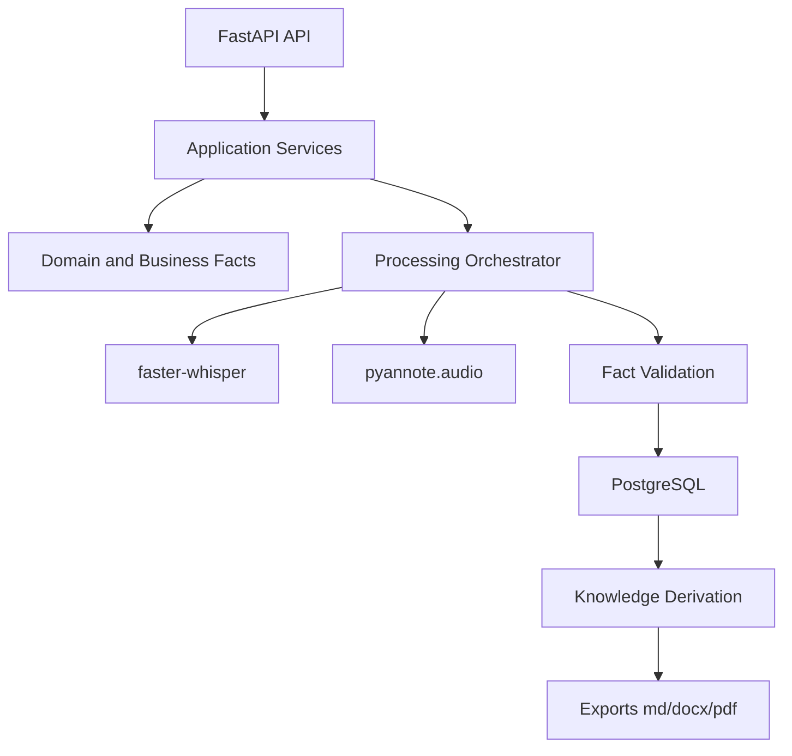
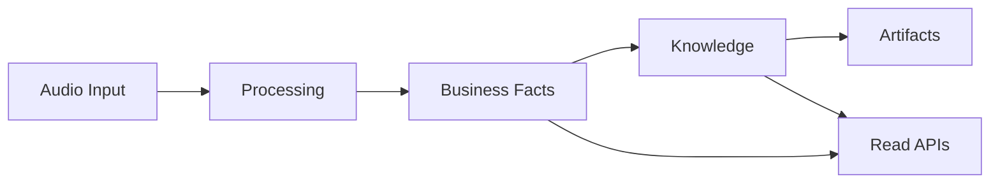

# 11 - MVP Technology Stack Proposal

**Project:** Intelligent Meeting Minutes Engine

**Version:** 1.0

**Status:** Draft

---

## Depends On

- 00-project-design-handbook.md
- 02-domain-ontology.md
- 03-domain-model.md
- 04-business-facts.md
- 05-knowledge-model.md
- 06-processing-pipeline.md
- 07-persistence-model.md
- 08-api-design.md
- 09-project-structure.md
- 10-implementation-plan.md

---

# 1. Purpose

This document proposes the initial technology stack for the MVP.

Its purpose is to provide a practical implementation baseline that remains compatible with the approved architecture, domain boundaries, and constraints.

---

# 2. Scope

This proposal defines:

- the initial MVP stack by layer;
- key library and runtime choices;
- rationale based on local/offline and open-source constraints;
- operational decisions to close critical open questions before Phase 3.

It does not define:

- final production hardening details;
- complete benchmark targets;
- full scaling architecture.

---

# 3. Dependencies

This document follows the priority order below.

- 00-project-design-handbook.md prevails on architectural and governance rules.
- 02-domain-ontology.md prevails on concept ownership and domain boundaries.
- 03-10 documents provide the operational and implementation context.

---

# 4. Definitions

## 4.1 MVP

MVP means the smallest end-to-end implementation that can:

- ingest one meeting audio;
- produce validated Business Facts;
- derive Knowledge Model outputs;
- generate at least one human-readable artifact;
- expose essential API endpoints for operation and review.

## 4.2 Compatibility

Compatibility means:

- no contradiction with normative documents;
- strict Business Domain/Knowledge Domain/Processing Domain separation;
- offline-first execution and FOSS-only dependencies.

---

# 5. Requirements and Open Questions Resolution

The following decisions are required to start implementation without ambiguity.

## 5.1 Resolved for MVP

1. Transcription stack for MVP.

- Decision: `faster-whisper` on CPU (int8/float16 as available) as primary transcription engine.
- Rationale: strong CPU performance and open-source licensing.

2. Diarization in MVP.

- Decision: `pyannote.audio` pipeline on CPU as the target diarization module, with graceful degradation when diarization confidence is low.
- Rationale: aligns with documented project technologies and v1 scope.

3. Export priority.

- Decision: Markdown export first, then DOCX and PDF in incremental slices inside Phase 4.
- Rationale: preserves incremental delivery while maintaining final scope commitments.

4. Database vs file-based MVP.

- Decision: PostgreSQL remains the single source of truth from Phase 2 onward. Local files are used only for binary artifacts and intermediate processing outputs.
- Rationale: aligns with ARCH-004 and storage conventions.

5. Knowledge mutability through API.

- Decision: Knowledge outputs are read-only in MVP.
- Rationale: prevents reinterpretation from being treated as source truth and simplifies integrity.

6. Export operation mode.

- Decision: export operations are asynchronous jobs.
- Rationale: avoids blocking API requests and fits restartability requirements.

7. Monolith vs modular packages.

- Decision: modular monolith for MVP.
- Rationale: one-person team, lower operational complexity, preserves internal boundaries.

8. API and processing runtime split.

- Decision: single deployable service with internal worker orchestration for MVP; process separation is deferred.
- Rationale: reduces operational overhead while preserving upgrade path.

## 5.2 Remaining Open Questions

- Final model-size policy for transcription by audio duration and hardware load.
- Exact confidence threshold policy per knowledge concept.
- Final PDF engine choice after local reproducibility test.

---

# 6. Design (Proposed Stack)

## 6.1 Runtime and Language

- Python 3.12
- Linux target runtime: Ubuntu Server 24.04

## 6.2 API Layer

- FastAPI
- Uvicorn
- Pydantic v2 for request/response validation

## 6.3 Domain and Application Layer

- Pure Python modules (no framework coupling)
- Pydantic models only at interface boundaries
- Service classes for use-case orchestration

## 6.4 Persistence Layer

- PostgreSQL 16+
- SQLAlchemy 2.x (ORM/core)
- Alembic for migrations
- UUIDv7 policy in application/persistence adapters

## 6.5 Processing Layer

- FFmpeg for audio preprocessing
- `faster-whisper` for transcription
- `pyannote.audio` for diarization
- `spaCy` for rule-based NLP support and normalization

## 6.6 Knowledge Derivation

- Structured extraction and validation pipeline with Pydantic schemas
- Evidence linking model from Business Facts to knowledge outputs
- Confidence scoring utilities (deterministic and model-assisted)

## 6.7 Export Layer

- Markdown: native template renderer (Jinja2 or equivalent)
- DOCX: `python-docx`
- PDF: `weasyprint` or `reportlab` (final choice after local reproducibility test)

## 6.8 Background Execution and Scheduling

- MVP option: internal job runner with persistent job table and restart checkpoints
- Optional next step: `dramatiq` + Redis (only if operational complexity is justified)

## 6.9 Observability and Logging

- Structured JSON logs
- Correlation IDs across pipeline stages
- Local metrics capture for CPU/memory/runtime per stage

## 6.10 Testing

- `pytest`
- `pytest-cov`
- Integration tests with local PostgreSQL
- End-to-end smoke tests with sample audio fixtures

---

# 7. Diagrams

---

# 8. Data Models (Stack Configuration Matrix)

| Layer       | Primary Technology     | Secondary/Support                 |
| ----------- | ---------------------- | --------------------------------- |
| API         | FastAPI                | Uvicorn, Pydantic v2              |
| Domain      | Python modules         | Dataclasses/typing                |
| Persistence | PostgreSQL             | SQLAlchemy 2.x, Alembic           |
| Processing  | FFmpeg, faster-whisper | pyannote.audio, spaCy             |
| Knowledge   | Pydantic schemas       | Rule evaluators                   |
| Exports     | Markdown renderer      | python-docx, weasyprint/reportlab |
| Tests       | pytest                 | pytest-cov                        |
| Logging     | JSON logs              | correlation_id conventions        |

---

# 9. Interfaces

## 9.1 IF-STACK-001 Processing to Facts

Input:

- processed audio evidence;
- segment and speaker candidates.

Output:

- validated Business Facts aligned with 04-business-facts.md.

## 9.2 IF-STACK-002 Facts to Knowledge

Input:

- immutable Business Facts.

Output:

- structured knowledge outputs with evidence and confidence.

## 9.3 IF-STACK-003 Knowledge to Artifacts

Input:

- knowledge outputs.

Output:

- Markdown/DOCX/PDF exports, without upstream feedback.

---

# 10. Implementation Alignment by Phase

- Phase 0: Python baseline, lint/test scaffolding, ADR/checklist workflow.
- Phase 1: domain and facts modules with invariants and immutability tests.
- Phase 2: PostgreSQL + SQLAlchemy + Alembic baseline.
- Phase 3: FFmpeg + faster-whisper + pyannote MVP flow to validated facts.
- Phase 4: knowledge derivation + Markdown first, then DOCX/PDF.
- Phase 5: API completion, hardening, end-to-end tests and runbook.

---

# 11. Error Handling

## 11.1 Recoverable

- model loading delays;
- low-confidence diarization segments;
- temporary export generation failure.

Action:

- retry with checkpoint recovery;
- mark provisional outputs when policy allows;
- persist diagnostic logs.

## 11.2 Fatal

- contradiction with immutable Business Facts;
- missing meeting context;
- non-traceable knowledge output.

Action:

- stop affected workflow;
- emit contradiction/validation record;
- require corrective action before continuation.

---

# 12. Future Improvements

- Introduce process-level separation for API and workers after MVP stabilization.
- Add performance profile presets for small/medium/large meetings.
- Add OpenAPI contract-first generation and stricter schema compatibility checks.

---

# 13. Changelog

## 1.0.0

- Created MVP technology stack proposal.
- Resolved critical implementation open questions for MVP start.
- Aligned stack choices with offline/FOSS constraints and architecture rules.
